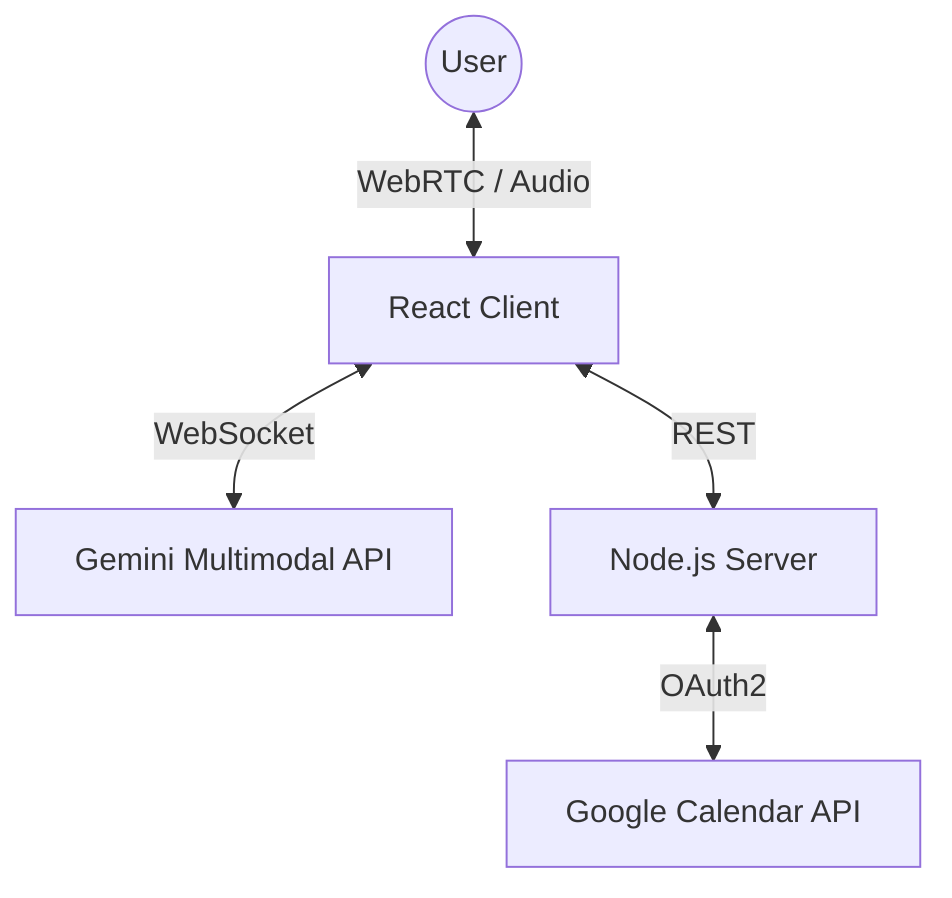

# Vikara: Voice Agent

<div align="center">
  <br/><br/>
  <a href="https://vikara-voice-agent.vercel.app/">🔗 View Live Demo</a> • 
  <a href="#features">✨ Features</a> • 
  <a href="#system-architecture">🏗 Architecture</a> • 
  <a href="#local-development">🏃‍♂️ Local Development</a>
</div>

---

## 🚀 Overview

**Vikara** is a real-time, multimodal **voice-first AI scheduling agent** capable of managing complex calendar operations through natural conversation.

Unlike traditional chatbots, Vikara leverages **Google’s Gemini Multimodal Live API** to process continuous audio streams with **sub-500ms latency**, while orchestrating **deterministic backend workflows** via the Google Calendar API.

> **Mission**  
> To demonstrate the future of **Voice-First productivity systems** by tightly coupling Large Multimodal Models (LMMs) with reliable backend infrastructure.

---

## ✨ Key Features <a id="features"></a>

- **Real-Time Voice Interruption (Barge-In)**  
  Users can interrupt the agent naturally mid-speech without breaking conversation flow.

- **Deterministic Tool Calling**  
  Scheduling decisions are never hallucinated — the agent queries real calendar availability before acting.

- **Automatic Conflict Resolution**  
  Detects overlapping meetings and proposes intelligent alternative slots.

- **Timezone-Aware Scheduling**  
  ISO-8601 normalization ensures accurate scheduling across global timezones.

- **Context Retention**  
  Follow-ups like “change that to 4 PM” modify the original intent seamlessly.

---

## 🛠️ Tech Stack

| Layer | Technology | Why |
|-----|-----------|-----|
| **AI Core** | Google Gemini 2.0 Flash | Ultra-low latency audio-to-audio streaming |
| **Frontend** | React 19 + Vite | Fast rendering + Web Audio API integration |
| **Backend** | Node.js + Express | Lightweight orchestration & API mediation |
| **Authentication** | OAuth 2.0 | Secure Google Identity integration |
| **State Management** | Hybrid (Memory + Cloud) | Fast conversation context + calendar integrity |

---

## 🏗️ System Architecture <a id="system-architecture"></a>



---

## ⚡ Deployment & Security

- **Frontend**  
  Deployed on **Vercel Edge Network** for minimal latency.

- **Backend**  
  Containerized and deployed on **Render (Node 20 Alpine)**.

- **Security Note**  
  For this MVP, the WebSocket connection to Gemini is initiated client-side to minimize audio latency.  
  In a production-grade enterprise system, this stream should be proxied through a **TURN server or backend relay** to strictly isolate API keys and credentials.

---

## 🏃‍♂️ Local Development <a id="local-development"></a>

### 1️⃣ Clone the Repository

```bash
git clone https://github.com/yourusername/vikara.git
```

### 2️⃣ Backend Setup

```bash
cd server
npm install
```

Create a `.env` file:

```env
GOOGLE_CLIENT_ID=your_client_id
GOOGLE_CLIENT_SECRET=your_client_secret
GOOGLE_REDIRECT_URI=http://localhost:3000/auth/callback
# App Configuration
PORT=8000
FRONTEND_ORIGIN=http://localhost:3000
```

Start backend:

```bash
npm start
```

### 3️⃣ Frontend Setup

```bash
cd ..
npm install
```

Create `.env.local`:

```env
VITE_GEMINI_API_KEY=your_gemini_api_key
# Backend URL (Local)
VITE_BACKEND_URL=http://localhost:8000
```

Run frontend:

```bash
npm run dev
```

---

## 🧪 Advanced Testing Scenarios

I recommend testing these specific workflows to observe the agent's reasoning capabilities:

### 1. Temporal Grounding (Real-World Knowledge)
*Demonstrates the agent's ability to use Google Search to resolve cultural references before scheduling.*
- **User:** "Schedule a planning session on **Republic Day** at 10 AM."
- **Agent Behavior:** 
  1. Calls `googleSearch` to identify the date of Republic Day (Jan 26th) for the current year.
  2. Converts to ISO-8601 format.
  3. Checks availability and creates the event.

### 2. Contextual Memory & Modification
*Demonstrates the ability to retain intent parameters across conversation turns.*
- **User:** "Book a strategy sync with Alex for 3 PM."
- **Agent:** "Okay, I have a strategy sync with Alex at 3 PM. Shall I confirm?"
- **User:** "**Actually, move that to 4 PM** and change the title to 'Deployment Review'."
- **Agent Behavior:** 
  1. Retains the email (Alex) from the first turn.
  2. Overwrites the Time and Title.
  3. Confirms the *updated* composite request before calling the API.

### 3. Conflict Resolution & Negotiation
*Demonstrates deterministic logic and state management.*
- **User:** "Book a sync for today at [Time you are busy]."
- **Agent Behavior:**
  1. Queries backend `freebusy` endpoint.
  2. Detects the conflict.
  3. **Rejects the request** and proposes the next available slot immediately following the conflict.

### 4. Global Timezone Normalization
*Demonstrates ISO-8601 handling.*
- **User:** "Book a call for 9 AM **London time** tomorrow."
- **Agent Behavior:**
  1. Calculates the offset difference between the User's browser locale and London (GMT/BST).
  2. Sends the correct converted ISO timestamp to the backend (e.g., booking it at 2:30 PM IST).
---

## ⚠️ Demo Note: Cold Start Latency

Backend runs on **Render Free Tier** and may spin down.

- Initial request may take **40–60 seconds**
- Subsequent requests respond in **<100ms**

---

## 📌 Closing Note

Vikara AI Voice Agent showcases how **voice, multimodal models, and deterministic APIs** can work together reliably.
