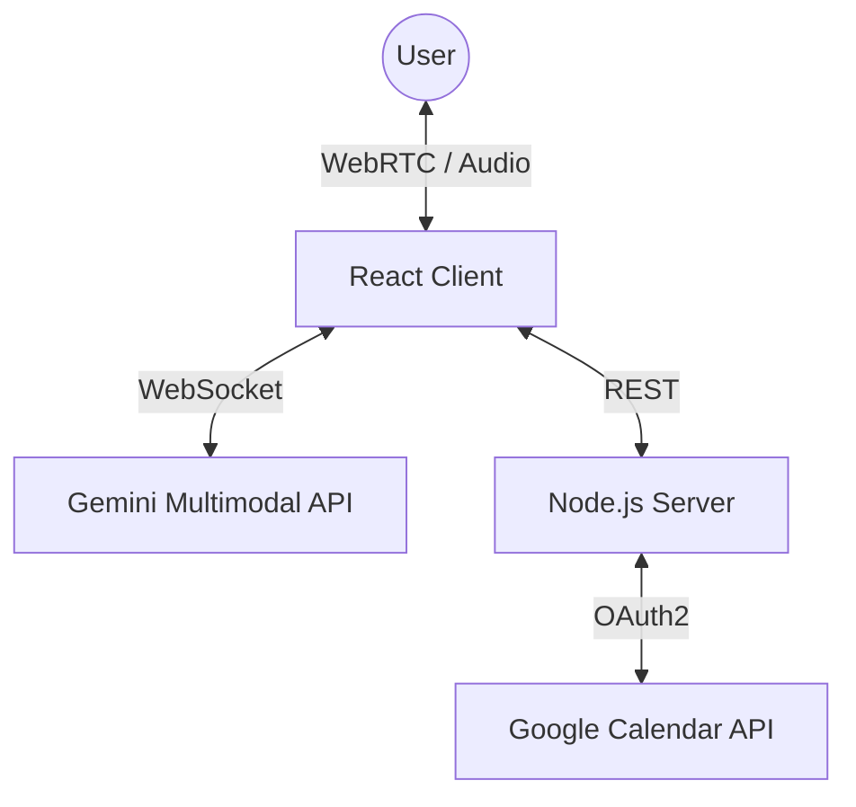

# Vikara: Multimodal Voice Scheduling Agent

<div align="center">
  
  <br/><br/>
  <a href="DEPLOYED_LINK_HERE">🔗 View Live Demo</a> • 
  <a href="#features">✨ Features</a> • 
  <a href="#system-architecture">🏗 Architecture</a> • 
  <a href="#local-development">🏃‍♂️ Local Development</a>
</div>

---

## 🚀 Overview

**Vikara** is a real-time, multimodal **voice-first AI scheduling agent** capable of managing complex calendar operations through natural conversation.

Unlike traditional chatbots, Vikara leverages **Google’s Gemini Multimodal Live API** to process continuous audio streams with **sub-500ms latency**, while orchestrating **deterministic backend workflows** via the Google Calendar API.

> **Mission**  
> To demonstrate the future of **Voice-First productivity systems** by tightly coupling Large Multimodal Models (LMMs) with reliable backend infrastructure.

---

## ✨ Key Features <a id="features"></a>

- **Real-Time Voice Interruption (Barge-In)**  
  Users can interrupt the agent naturally mid-speech without breaking conversation flow.

- **Deterministic Tool Calling**  
  Scheduling decisions are never hallucinated — the agent queries real calendar availability before acting.

- **Automatic Conflict Resolution**  
  Detects overlapping meetings and proposes intelligent alternative slots.

- **Timezone-Aware Scheduling**  
  ISO-8601 normalization ensures accurate scheduling across global timezones.

- **Context Retention**  
  Follow-ups like “change that to 4 PM” modify the original intent seamlessly.

---

## 🛠️ Tech Stack

| Layer | Technology | Why |
|-----|-----------|-----|
| **AI Core** | Google Gemini 2.0 Flash | Ultra-low latency audio-to-audio streaming |
| **Frontend** | React 19 + Vite | Fast rendering + Web Audio API integration |
| **Backend** | Node.js + Express | Lightweight orchestration & API mediation |
| **Authentication** | OAuth 2.0 | Secure Google Identity integration |
| **State Management** | Hybrid (Memory + Cloud) | Fast conversation context + calendar integrity |

---

## 🏗️ System Architecture <a id="system-architecture"></a>



---

## ⚡ Deployment & Security

- **Frontend**  
  Deployed on **Vercel Edge Network** for minimal latency.

- **Backend**  
  Containerized and deployed on **Render (Node 20 Alpine)**.

- **Security Note**  
  For this MVP, the WebSocket connection to Gemini is initiated client-side to minimize audio latency.  
  In a production-grade enterprise system, this stream should be proxied through a **TURN server or backend relay** to strictly isolate API keys and credentials.

---

## 🏃‍♂️ Local Development <a id="local-development"></a>

### 1️⃣ Clone the Repository

```bash
git clone https://github.com/yourusername/vikara.git
```

### 2️⃣ Backend Setup

```bash
cd server
npm install
```

Create a `.env` file:

```env
GOOGLE_CLIENT_ID=your_client_id
GOOGLE_CLIENT_SECRET=your_client_secret
GOOGLE_REDIRECT_URI=http://localhost:3000/auth/callback
```

Start backend:

```bash
npm start
```

### 3️⃣ Frontend Setup

```bash
cd ..
npm install
```

Create `.env.local`:

```env
VITE_GEMINI_API_KEY=your_gemini_api_key
```

Run frontend:

```bash
npm run dev
```

---

## 🧪 Example Testing Scenarios

- **“Am I free tomorrow afternoon?”**  
  → Queries Google Calendar freebusy API.

- **“Book a meeting with Alex at 3 PM”**  
  → Collects title, time, and participant email.

- **“Change that to 4 PM”**  
  → Context-aware modification of the original intent.

---

## ⚠️ Demo Note: Cold Start Latency

Backend runs on **Render Free Tier** and may spin down.

- Initial request may take **40–60 seconds**
- Subsequent requests respond in **<100ms**

---

## 📌 Closing Note

Vikara is a **systems-level demo**, showcasing how **voice, multimodal models, and deterministic APIs** can work together reliably.
